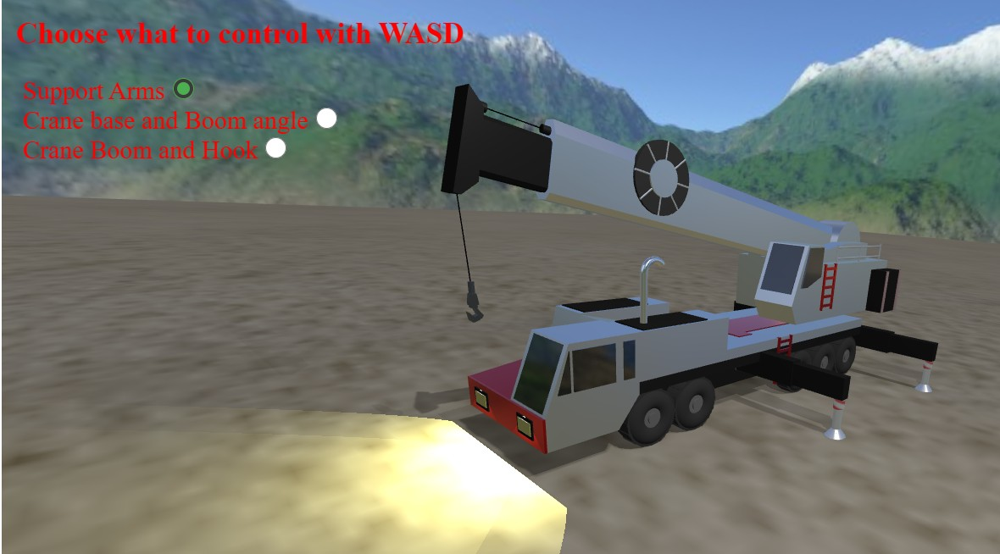

## Three.js School Project - Recreate Link-Belt ATC-3275 All Terrain Crane in Three.js

Full coding timelapse: https://youtu.be/N3mHkMvP_vQ

***

***


## Installasjon
Last ned [Node.js](https://nodejs.org/en/download/).
Installer og bruk følgende kommandoer:

``` bash
# ... til å installere avhengigheter, kjøres kun føste gang:
npm install

# ... til å starte server (på egen maskin) for kjøring av applikasjonen: 
npm run dev

# Bygg for produksjon. Resultatet blir liggende i /dist mappa.
npm run build
```
